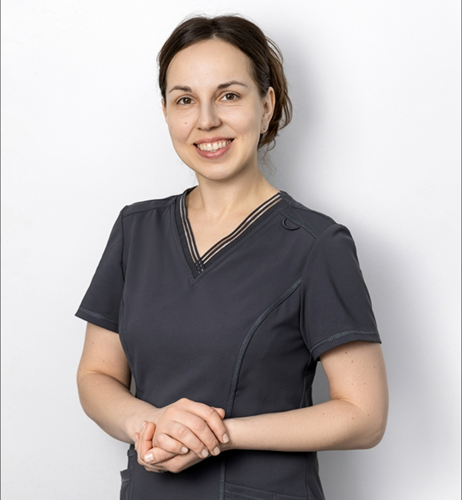

# true-dentistry
index.html
<!DOCTYPE html><html lang="uk">
<head>
  <meta charset="UTF-8" />
  <meta name="viewport" content="width=device-width, initial-scale=1.0" />
  <title>True Dentistry — Стоматологія в Києві</title>
  <meta name="description" content="Сучасна стоматологія True Dentistry у Києві. Професійне лікування зубів, турбота та комфорт. Запис за телефоном +380978888528" />  </head>
<body><header>
  

    <!-- ЗАМІНІТЬ ЦЕЙ ТЕКСТ НА ЛОГОТИП (img), КОЛИ БУДЕ ПОТРІБНО -->
    
True Dentistry

    <a class="phone" href="tel:+380978888528">+38 (097) 888-85-28</a>
  

</header><section class="hero">
  

    <h1>Сучасна стоматологія в Києві</h1>
    

      True Dentistry — це турбота, професіоналізм та комфорт.
      Ми допомагаємо зберегти здорову та красиву усмішку.
    

    <a class="btn" href="tel:+380978888528">Записатися на прийом</a>
  

</section><section>
  

    <h2 class="section-title">Наші послуги</h2>
    

      

        <h3>Терапевтичне лікування</h3>
        
Лікування карієсу та відновлення зубів

      

      

        <h3>Професійна гігієна</h3>
        
Чистка, полірування, профілактика

      

      

        <h3>Ортопедія</h3>
        
Коронки, вініри, протезування

      

      

        <h3>Імплантація</h3>
        
Сучасні та надійні рішення

      

    

  

</section><section style="background:#ffffff">
  

    <h2 class="section-title">Про клініку</h2>
    

      Ми працюємо з сучасним обладнанням та матеріалами.
      Для нас важливі безпека, комфорт і довіра кожного пацієнта.
    

  

</section><section>
  

    <h2 class="section-title">Наш лікар</h2>
    

      

        
        <h3>Ковальова Ольга Анатоліївна</h3>
        
<strong>Головний лікар Ортодонт</strong>

        
Професійний підхід, індивідуальні плани лікування та турбота про кожного пацієнта.

      

    

  

</section><section>
  

    <h2 class="section-title">Контакти</h2>
    

      
<strong>Адреса:</strong> м. Київ, вул. Князів Острозьких 41/8

      
<strong>Телефон:</strong> <a class="phone" href="tel:+380978888528">+38 (097) 888-85-28</a>

    

  

</section><footer>
  
© True Dentistry, Київ

</footer></body>
</html>
