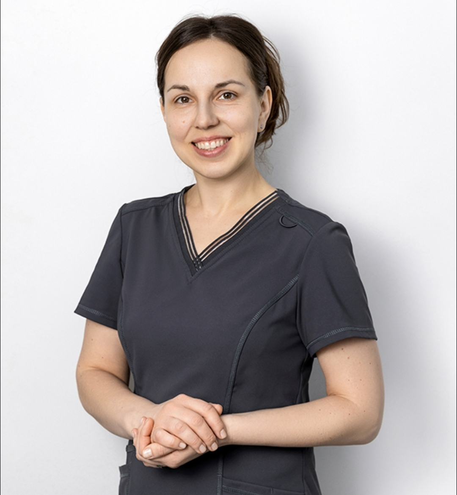

<!DOCTYPE html>
<html lang="uk">
<head>
  <meta charset="UTF-8">
  <meta name="viewport" content="width=device-width, initial-scale=1.0">
  <title>True Dentistry — Преміальна стоматологія в Києві</title>

  
</head>

<body>

<header>
  
TRUE DENTISTRY

  <nav>
    <a href="#services">Послуги</a>
    <a href="#doctor">Лікар</a>
    <a href="#contacts">Контакти</a>
  </nav>

  <a class="call-btn" href="tel:+380978888528">📞 Зателефонувати</a>
</header>

<section>
  <h1>Сучасна стоматологія в Києві</h1>
  
Професіоналізм, комфорт і преміальний сервіс

</section>

<section id="services">
  <h2>Наші послуги</h2>

  

    
Терапевтичне лікування

    
Професійна гігієна

    
Ортопедія

    
Імплантація

  

</section>

<section id="doctor">
  <h2>Головний лікар</h2>

  

  <h3>Ковальова Ольга Анатоліївна</h3>
  
<strong>Ортодонт, головний лікар</strong>

</section>

<section id="contacts">
  <h2>Контакти</h2>
  
м. Київ, вул. Князів Острозьких 41/8

  
<a href="tel:+380978888528" style="color:var(--gold)">+38 (097) 888-85-28</a>

</section>

<footer>
  © True Dentistry, Київ
</footer>

</body>
</html>
<!DOCTYPE html>
<html lang="uk">
<head>
  <meta charset="UTF-8">
  <meta name="viewport" content="width=device-width, initial-scale=1.0">
  <title>True Dentistry — Преміальна стоматологія в Києві</title>

  
</head>

<body>

<header>
  
TRUE DENTISTRY

  <nav>
    <a href="#services">Послуги</a>
    <a href="#doctor">Лікар</a>
    <a href="#contacts">Контакти</a>
  </nav>

  <a class="call-btn" href="tel:+380978888528">📞 Зателефонувати</a>
</header>

<section>
  <h1>Сучасна стоматологія в Києві</h1>
  
Професіоналізм, комфорт і преміальний сервіс

</section>

<section id="services">
  <h2>Наші послуги</h2>

  

    
Терапевтичне лікування

    
Професійна гігієна

    
Ортопедія

    
Імплантація

  

</section>

<section id="doctor">
  <h2>Головний лікар</h2>

  

  <h3>Ковальова Ольга Анатоліївна</h3>
  
<strong>Ортодонт, головний лікар</strong>

</section>

<section id="contacts">
  <h2>Контакти</h2>
  
м. Київ, вул. Князів Острозьких 41/8

  
<a href="tel:+380978888528" style="color:var(--gold)">+38 (097) 888-85-28</a>

</section>

<footer>
  © True Dentistry, Київ
</footer>

</body>
</html>
